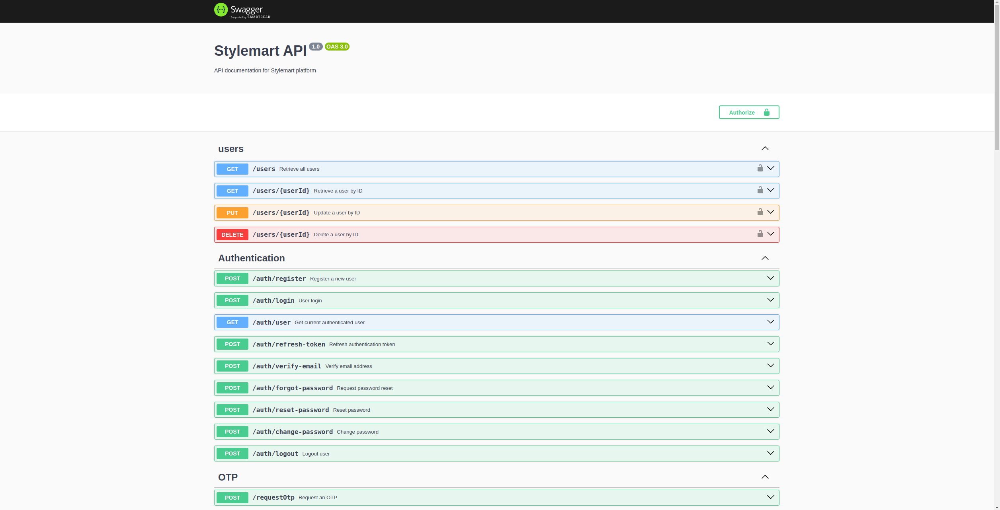

# E-Commerce API

This is an e-commerce API built using **NestJS**, **TypeORM**, and **MySQL**.

## Features

- **User Authentication & Authorization**   
  - Secure user registration and login using JWT authentication.  
  - Role-based access control for customers and administrators.  

- **Product Management**   
  - Create, update, delete, and retrieve products with categories and pricing.  
  - Support for product inventory tracking and stock management.  

- **Order Processing**  
  - Cart management, order creation, and checkout functionality.  
  - Order status updates and history tracking.  

- **Payment Integration**  
  - Seamless payment processing via **MPESA**, ensuring secure transactions.  

- **Database Management**  
  - **TypeORM** is used for database interactions with **MySQL**.  

## Technologies Used

- **NestJS** - A progressive Node.js framework for building efficient and scalable applications.  
- **TypeORM** - An ORM for TypeScript and JavaScript, supporting database interactions.  
- **MySQL** - A relational database for storing e-commerce data.  
- **MPESA API** - Integrated payment gateway for seamless transactions.  
